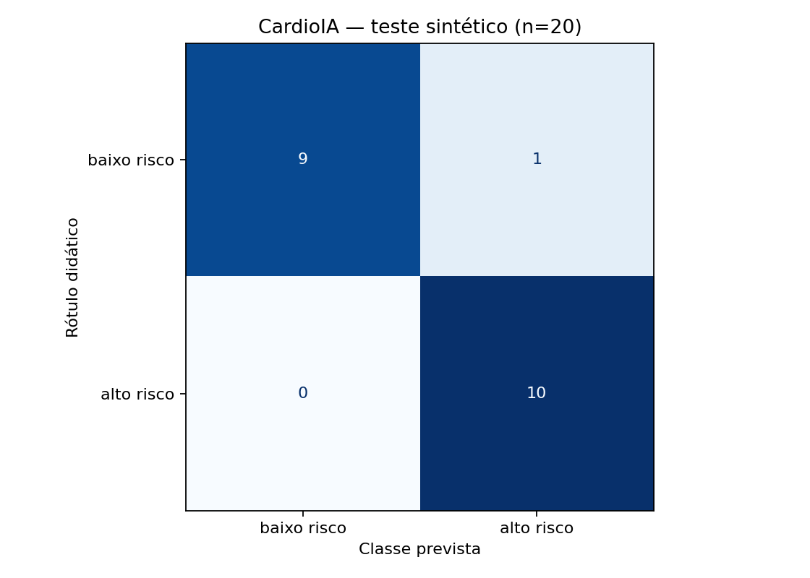

# FIAP - Faculdade de Informática e Administração Paulista

<p align="center"><a href="https://www.fiap.com.br/"></a></p>

# CardioIA — IA no Estetoscópio Digital

## Grupo 100

## 👨‍🎓 Integrante

- Felipe Bernardo Papaléo de Oliveira.

## 👩‍🏫 Professores

### Professora

- [Sabrina Otoni — SabrinaOtoni](https://github.com/SabrinaOtoni), indicada para colaboração no repositório.

### Coordenação

Equipe de coordenação do curso de Inteligência Artificial da FIAP.

## 📜 Descrição

O CardioIA é um experimento acadêmico de processamento de linguagem natural para a Fase 2. A solução lê dez relatos fictícios, identifica expressões de sintomas e apresenta hipóteses educacionais a partir de um mapa CSV. Um segundo módulo usa TF-IDF e regressão logística para classificar frases nos rótulos didáticos “baixo risco” e “alto risco”.

A base de classificação contém 80 frases sintéticas, balanceadas entre as classes. O vocabulário e o IDF são ajustados somente nos 60 exemplos de treino; 20 ficam reservados para teste. O notebook registra métricas, baseline, matriz de confusão, predições, termos influentes e testes adicionais de linguagem e de invariância demográfica.

O objetivo é demonstrar uma implementação reproduzível e discutir distorções, não construir um instrumento de atendimento. As associações são inespecíficas e os rótulos não foram validados clinicamente. **Não usar para diagnóstico, triagem de pessoas reais ou orientação de conduta.** Os dados não contêm prontuários ou informações de pacientes reais.

O trabalho foi preparado com assistência de IA e sua publicação foi aprovada pelo integrante. O escopo inclui as duas partes obrigatórias; os desafios opcionais “Ir Além” não integram esta versão.

## 🎬 Demonstração

Vídeo preparado: **3 minutos**, com capturas da execução local e explicações textuais na tela, sem narração. Arquivo de revisão: `cardioia-fase2-demonstracao.mp4`, entregue separadamente do código.

[Assistir à demonstração no YouTube — não listado](https://youtu.be/NkU1Qqp_IdA).

Repositório público: [omninc/grupo-100-cardioia-fase2](https://github.com/omninc/grupo-100-cardioia-fase2).

## 📁 Estrutura de pastas

Estrutura adaptada do [template FIAP](https://github.com/agodoi/templateFiapVfinal), commit `50e1e2720637b222357a7ebd1919c38a44af7cd2`.

```text
.github/workflows/validar.yml      # verificações automatizadas
assets/logo-fiap.png               # recurso original do template
config/modelo.json                 # protocolo fixo
data/relatos.txt                   # 10 relatos completos
data/mapa_conhecimento.csv         # associações e referências
data/frases_rotuladas.csv          # 80 frases e rótulos
data/desafios_linguisticos.csv     # 12 casos adicionais
document/ai_project_document_fiap.md
document/dados_e_limites.md
document/checklist_entrega.md
document/demo.html                 # apoio visual da demonstração
notebooks/cardioia_fase2.ipynb      # notebook executado com saídas
results/                          # resultados reproduzíveis
scripts/demo.py                    # demonstração local
scripts/executar_notebook.py
src/extracao.py
src/classificador.py
tests/test_extracao.py
requirements.txt
```

## 🔧 Como executar o código

Pré-requisito: **Python 3.12**. Execute os comandos na raiz do projeto. A primeira instalação requer internet; os experimentos usam somente os arquivos locais.

```bash
python -m venv .venv
```

Windows PowerShell:

```powershell
.venv\Scripts\python.exe -m pip install -r requirements.txt
.venv\Scripts\python.exe -m src.extracao
.venv\Scripts\python.exe -m src.classificador
.venv\Scripts\python.exe scripts/executar_notebook.py
.venv\Scripts\python.exe -m unittest discover -s tests -v
```

Linux/macOS:

```bash
.venv/bin/python -m pip install -r requirements.txt
.venv/bin/python -m src.extracao
.venv/bin/python -m src.classificador
.venv/bin/python scripts/executar_notebook.py
.venv/bin/python -m unittest discover -s tests -v
```

Também é possível abrir `notebooks/cardioia_fase2.ipynb` em VS Code/Jupyter, selecionar o ambiente instalado e executar todas as células. O script de execução usa um kernel limpo e salva as saídas.

Para a demonstração visual, execute `python scripts/demo.py` com o Python desse ambiente e abra **http://127.0.0.1:8765/document/demo.html**. Use apenas exemplos fictícios. O servidor é local e não é adequado para produção; encerre com Ctrl+C. A interface é um apoio à apresentação, não o portal React do desafio opcional.

## 📊 Resultados executados

| Medida | Resultado |
|---|---:|
| Treino / teste | 60 / 20 |
| Acurácia no teste | 95% (19/20) |
| Baseline de classe mais frequente | 50% |
| Precisão / recall de “alto risco” | 90,9% / 100% |
| F1 macro | 0,9499 |
| Desafios linguísticos | 66,7% (8/12) |
| Pares contrafactuais com mudança de rótulo | 0 de 4 |



O erro no teste foi “Estou com nariz escorrendo e sem dificuldade para respirar.”: o rótulo didático era baixo risco, mas a previsão foi alto risco. Nos quatro desafios de negação, o modelo acertou apenas um. Termos associados a alerta podem dominar mesmo quando negados. O resultado deixa clara a distância entre encontrar padrões de texto e compreender um relato.

A estabilidade dos pares de gênero/idade não comprova equidade: essas características quase não aparecem no treinamento. A base é pequena e possui atalhos lexicais, portanto 95% não pode ser generalizado para a população. Leia [dados e limites](document/dados_e_limites.md) e o [relatório do projeto](document/ai_project_document_fiap.md).

Validação local: seis testes automatizados de extração aprovados, classificação executada e notebook integralmente executado sem erro. A configuração de CI está incluída; não se afirma execução remota antes da publicação.

## 🗃 Histórico de lançamentos

- **0.1.0 — 07/10/2026:** atividade obrigatória da Fase 2, dados sintéticos, extração, classificador, notebook, avaliação crítica e demonstração publicada após aprovação do integrante.

## 📚 Referências

- [NHLBI — sintomas de infarto](https://www.nhlbi.nih.gov/health/heart-attack/symptoms)
- [NHLBI — sintomas de insuficiência cardíaca](https://www.nhlbi.nih.gov/health/heart-failure/symptoms)
- [NHLBI — sintomas de arritmias](https://www.nhlbi.nih.gov/health/arrhythmias/symptoms)
- [NHLBI — doença coronariana](https://www.nhlbi.nih.gov/health/coronary-heart-disease/symptoms)
- [scikit-learn — extração de atributos e TF-IDF](https://scikit-learn.org/stable/modules/feature_extraction.html)
- [scikit-learn — vazamento de dados e boas práticas](https://scikit-learn.org/stable/common_pitfalls.html)

Fontes consultadas em 07/10/2026. Fundamentam associações gerais e métodos, não validam o dataset sintético.

## 📋 Licença e atribuição

Estrutura e logo derivados do [MODELO GIT FIAP](https://github.com/agodoi/templateFiapVfinal), por [FIAP](https://fiap.com.br), disponibilizado sob [Creative Commons Attribution 4.0 International](https://creativecommons.org/licenses/by/4.0/). Foram adaptados o README e o documento do projeto, e acrescentados código, dados e resultados. A marca FIAP é mantida apenas para identificação acadêmica. Não há concessão adicional de licença sobre o código original nesta versão de revisão.
